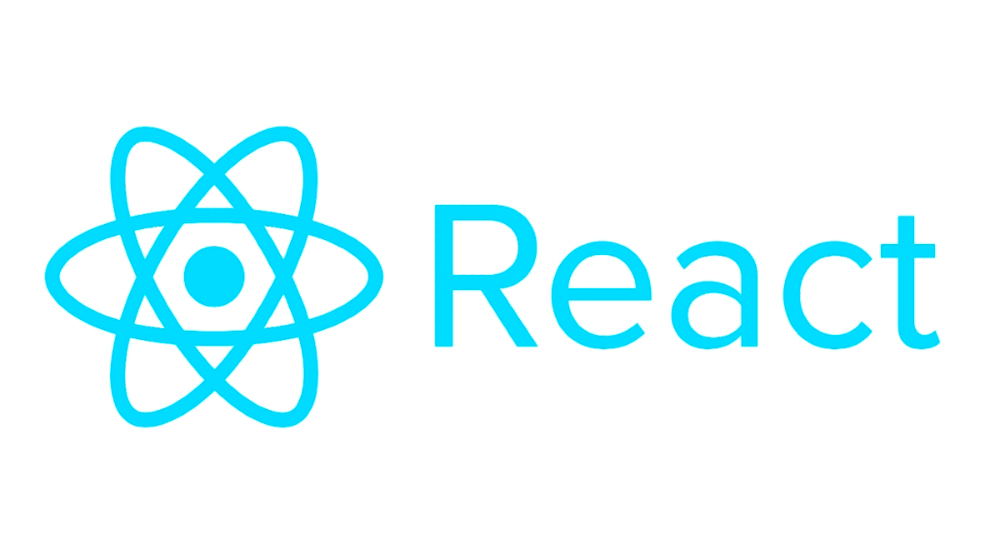

# React-Study
## React 资料（2023）
### Main APIs(主要API)
- [createContext](https://react.dev/reference/react/createContext)
- [createPortal](https://react.dev/reference/react-dom/createPortal)
- [forwardRef](https://react.dev/reference/react/forwardRef)
- [`<Fragment>`](https://react.dev/reference/react/Fragment)
- [lazy](https://react.dev/reference/react/lazy)
- [memo](https://react.dev/reference/react/memo)
- [`<Profiler>`](https://react.dev/reference/react/Profiler)
- [`<StrictMode>`](https://react.dev/reference/react/StrictMode)

### Hooks:(React 内置的 hooks)
- [useCallback](https://react.dev/reference/react/useCallback)
- [useContext](https://react.dev/reference/react/useContext)
- [useDeferredValue](https://react.dev/reference/react/useDeferredValue)
- [useEffect](https://react.dev/reference/react/useEffect)
- [useId](https://react.dev/reference/react/useId)
- [useMemo](https://react.dev/reference/react/useMemo)
- [useReducer](https://react.dev/reference/react/useReducer)
- [useRef](https://react.dev/reference/react/useRef)
- [useState](https://react.dev/reference/react/useState)
- [useSyncExternalStore](https://react.dev/reference/react/useSyncExternalStore)

### New APIs(新 APIs) 
- [React cache](https://react.dev/reference/react/cache#cache)
- [React Server Components](https://react.dev/blog/2023/03/22/react-labs-what-we-have-been-working-on-march-2023#react-server-components)
- [Server Actions](https://nextjs.org/docs/app/api-reference/functions/server-actions)
- [startTransition](https://react.dev/reference/react/startTransition)
- [`<Suspense>`](https://react.dev/reference/react/Suspense)
- [Taint API](https://react.dev/reference/react/experimental_taintUniqueValue)
- [use() Hook](https://react.dev/learn/reusing-logic-with-custom-hooks#when-to-use-custom-hooks)
- [useFormState](https://react.dev/reference/react-dom/hooks/useFormState#noun-labs-1201738-(2))
- [useFormStatus](https://react.dev/reference/react-dom/hooks/useFormStatus#noun-labs-1201738-(2))
- [useTransition](https://react.dev/reference/react/useTransition)

### Component Libraries(组件库)
- [Ant Design](https://ant.design/index-cn)
- [Chakra UI](https://chakra-ui.com)
- [Headless UI](https://headlessui.com)
- [MUI](https://mui.com)
- [Radix](https://www.radix.com)
- [React Bootstrap](https://react-bootstrap.netlify.app)
- [shadcn/ui](https://ui.shadcn.com)
- [React Aria](https://react-spectrum.adobe.com/react-aria)
- Animation (动画库)
    - [Framer Motion](https://www.framer.com/motion/animation/)
    - [React-Spring](https://www.react-spring.dev)
    - [React Motion](https://github.com/chenglou/react-motion)
    - [AutoAnimate](https://auto-animate.formkit.com)
    - [React Native Reanimated](https://docs.swmansion.com/react-native-reanimated)
- Data Visualization (数据可视化库)
    - [D3](https://d3js.org)
    - [Nivo](https://nivo.rocks)
    - [React-Vis](https://uber.github.io/react-vis)
    - [Recharts](https://recharts.org)
    - [Tremor](https://www.tremor.so)
    - [Victory](https://formidable.com/open-source/victory)
    - [Visx](https://airbnb.io/visx)
- Form Libraries
    - [React Hook Form](https://react-hook-form.com)
    - [react-jsonschema-form](https://rjsf-team.github.io/react-jsonschema-form/docs)
    - [Formik](https://formik.org)
    - [@formily/core](https://core.formilyjs.org)
   
- CSS 工具库
    - [CSS Modules](https://github.com/css-modules/css-modules)
    - [Emotion](https://emotion.sh/docs/introduction)
    - [Sass/SCSS](https://sass-lang.com)
    - [Stitches](https://stitches.dev)
    - [Styled Components](https://styled-components.com)
    - [Styled JSX](https://github.com/vercel/styled-jsx)
    - [Tailwind CSS](https://tailwindcss.com)
    - [UnoCSS](https://unocss.dev)
    - [vanilla-extract](https://vanilla-extract.style)
### 状态管理(用于管理应用程序状态的工具库)
- [Jotai](https://jotai.org)
- [MobX](https://mobx.js.org/README.html)
- [Recoil](https://recoiljs.org)
- [Redux](https://react-redux.js.org)
- [Redux Toolkit](https://redux-toolkit.js.org)
- [useState](https://react.dev/reference/react/useState)
- [XState](https://xstate.js.org)
- [Zustand](https://zustand-demo.pmnd.rs)
### 数据加载(用于加载和管理数据的实用工具)
- [Apollo Client](https://www.apollographql.com/docs/react)
- [Relay](https://relay.dev)
- [RTK Query](https://redux-toolkit.js.org/rtk-query/overview)
- [SWR](https://swr.vercel.app/zh-CN)
- [TanStack Query (React Query)](https://tanstack.com/query/latest)
- [tRPC](https://trpc.io)
- [Fetch](https://developer.mozilla.org/en-US/docs/Web/API/Fetch_API)
### Meta-Frameworks Back-End & Infrastructure (元框架 后端和基础设施)
- [Astro](https://astro.build)
- [Create React App](https://create-react-app.dev)
- [Gatsby](https://www.gatsbyjs.com)
- [Next.js](https://nextjs.org)
- [Remix](https://remix.run)
- [Redwood](https://redwoodjs.com)
- Build Tools(构建工具)
    - [webpack](https://webpack.js.org)
    - [Vite](https://vitejs.dev)
    - [tsup](https://tsup.egoist.dev)
    - [esbuild](https://esbuild.github.io)
    - [Rollup](https://rollupjs.org)
    - [tsc CLI](https://runebook.dev/en/docs/typescript/compiler-options)
    - [Parcel](https://parceljs.org)
    - [Turbopack](https://turbo.build/pack)
- 托管服务(用于托管 React 应用程序的服务)
    - [AWS](https://aws.amazon.com)
    - [Azure](https://azure.microsoft.com)
    - [Cloudflare](https://www.cloudflare.com)
    - [Digital Ocean](https://www.digitalocean.com)
    - [Fastly](https://www.fastly.com)
    - [Fly.io](https://fly.io)
    - [GitHub Pages](https://pages.github.com)
    - [Google Cloud](https://cloud.google.com)
    - [Heroku](https://www.heroku.com)
    - [Netlify](https://www.netlify.com)
    - [Render](https://render.com)
    - [Vercel](https://vercel.com)
- 其他服务(在 React 应用中使用的其他服务)
    - [Firebase](https://firebase.google.com)
    - [PlanetScale](https://planetscale.com)
    - [Prisma](https://www.prisma.io)
    - [Redis](https://redis.io)
    - [Sentry](https://sentry.io/welcome)
    - [Supabase](https://supabase.com)
    - [Upstash](https://upstash.com)
### 其他工具（其他 React 实用工具和库）
- Testing Libraries()
    - [Cypress](https://www.cypress.io)
    - [Jest](https://jestjs.io)
    - [Playwright](https://playwright.dev)
    - [Storybook](https://storybook.js.org)
    - [Testing Library](https://testing-library.com)
    - [Vitest](https://vitest.dev)
- React 渲染器
    - [React-DOM (React for the web)](https://legacy.reactjs.org/docs/react-dom.html)
    - [React Email](https://react.email)
    - [Ink](https://github.com/vadimdemedes/ink)
    - [React Native (Android)](https://reactnative.dev/docs/native-components-android)
    - [React Native (iOS)](https://reactnative.dev/docs/native-components-ios)
    - [React Native (macOS)](https://github.com/microsoft/react-native-macos)
    - [React Native Skia](https://github.com/Shopify/react-native-skia)
    - [React Native for Web](https://necolas.github.io/react-native-web/docs/)
    - [React Native (Windows)](https://github.com/microsoft/react-native-windows)
    - [React-pdf](https://react-pdf.org/)
    - [React Three Fiber](https://docs.pmnd.rs/react-three-fiber/getting-started/introduction)
    - [Remotion](https://www.remotion.dev)
- 模式和验证库
    - [joi](https://joi.dev)
    - [Zod](https://zod.dev)
    - [Yup](https://github.com/jquense/yup)
    - [io-ts](https://gcanti.github.io/io-ts)
- 身份验证
    - [Clerk](https://clerk.com)
    - [FusionAuth](https://fusionauth.io)
    - [Auth.js](https://authjs.dev)
    - [Lucia](https://lucia-auth.com)
    - [Passport](https://www.passportjs.org)
- Mobile Development
    - [Capacitor](https://capacitorjs.com/solution/react)
    - [Expo](https://expo.dev)
    - [Ionic](https://ionicframework.com/docs/react)
    - [React Native](https://reactnative.dev)
- 前端框架
    - [Alpine.js](https://alpinejs.dev)
    - [Angular](https://angular.dev)
    - [Ember](https://emberjs.com)
    - [Lit](https://lit.dev)
    - [Preact](https://preactjs.com)
    - [Qwik](https://qwik.builder.io)
    - [Solid](https://www.solidjs.com)
    - [Svelte](https://svelte.dev)
    - [Vue.js](https://vuejs.org)
### 架构和渲染模式
  - 边缘渲染
    - (在发送给客户端之前在边缘服务器 (Edge) 修改渲染的 HTML))
- 增量静态生成 
    - 即使在初始构建之后，也能动态增强或修改静态网站 (Next.js ISR, Gatsby DSG)
- 岛屿架构
    - 在一个静态网站中，通过多个入口点实现动态行为的孤岛 (Astro, Eleventy)
- 多页面应用 (MPA)
    - 完全在服务器上运行的应用程序，客户端动态行为极少 
- 局部注水
    - 只在客户端上对某些组件进行注水 (比如 React Server Components)
- Progressive Enhancement
    - 确保应用程序在没有 JavaScript 的情况下也能正常运行
- 渐进式注水
    - 控制在客户端上的对组件注水的顺序
- Resumability
    - 在服务器上序列化框架状态，使客户端能够在没有重复代码执行的情况下恢复执行
- 服务端渲染 (SSR)
    - 在服务器上动态渲染 HTML 内容，然后再在客户端上重新“注水”
- 单页面应用 (SPA)
    - 完全在浏览器中运行的应用
- 静态站点生成 (SSG)
    - 预渲染静态内容，可能会携带客户端动态元素
- 流式服务端渲染
    - 将服务器渲染的内容分解为较小的流式块
### 即将推出的新功能
- Asset Loading
    - 将 Suspense 与样式表、字体和图像的加载生命周期完全整合在一起
- React cache
    - 协助缓存数据的 API
- React Forget
- Offscreen Rendering
- 过渡追踪
    - 检测 React 过渡何时变慢，并调查变慢的原因
- use() Hook
    - use 可以解除对 Promise 的封装，但也可以在普通组件和 Hooks（包括客户端）中使用

### 资料（学习 React 时使用了哪些资源）
- Blogs、Magazines、Newsletters(博客、杂志、 新闻)
    - [Best of JS](https://bestofjs.org)
    - [React Digest](https://reactdigest.net)
    - [Smashing Magazine](https://www.smashingmagazine.com)
    - [LogRocket](https://blog.logrocket.com)
    - [CSS-Tricks](https://css-tricks.com)
    - [Reactiflux](https://www.reactiflux.com)
    - [JavaScript Weekly](https://javascriptweekly.com)
    - [Node Weekly](https://nodeweekly.com)
    - [Next.js Weekly](https://nextjsweekly.com)
    - [r/ReactJS](https://www.reddit.com/r/reactjs)
    - [React Status](https://react.statuscode.com)
    - [Bytes](https://bytes.dev)
    - [Dev.to](https://dev.to)
    - [This Week In React](https://thisweekinreact.com)
- Site、Courses(网站、课程)
    - [Wes Bos](https://wesbos.com)
    - [The Joy of React](https://www.joyofreact.com)
    - [Codecademy](https://www.codecademy.com)
    - [O'Reilly](https://www.oreilly.com)
    - [Egghead.io](https://egghead.io)
    - [react.gg](https://react.gg)
    - [Coursera](https://www.coursera.org)
    - [Build UI](https://buildui.com)
    - [Epic React](https://epicreact.dev)
    - [Scrimba](https://scrimba.com)
    - [Academind](https://academind.com)
    - [Udemy](https://www.udemy.com)
    - [Pluralsight](https://www.pluralsight.com)
    - [Frontend Masters](https://frontendmasters.com)
    - [Platzi](https://platzi.com)
    - [freeCodeCamp](https://www.freecodecamp.org)
    - [Stack Overflow](https://stackoverflow.com)
    - [Miguel Ángel Durán (midudev)](https://stars.github.com/profiles/midudev)
- Podcasts (播客)
    - [JavaScript Jabber](https://topenddevs.com/podcasts/javascript-jabber)
    - [JS Party](https://changelog.com/jsparty)
    - [React Native Show- JavaScript Jam](https://www.callstack.com/podcast)
    - [Front End Happy Hour](https://www.frontendhappyhour.com)
    - [HTTP 203](https://http203.libsyn.com)
    - [PodRocket](https://podrocket.logrocket.com)
    - [The Changelog](https://changelog.com/podcast)
    - [Ladybug Podcast](https://www.ladybug.dev)
    - [React Native Radio](https://reactnativeradio.com)
    - [Shop Talk Show](https://shoptalkshow.com)
    - [JAMStack Radio](https://www.heavybit.com/library/podcasts/jamstack-radio)
    - [Full Stack Radio](https://fullstackradio.com)
    - [Syntax](https://syntax.fm)
    - [React Podcast](https://spec.fm/podcasts/reactpodcast)

#### 参考链接：
- [State of React 2023](https://survey.devographics.com/zh-Hans/survey/state-of-react/2023)
- 
   
## 关于仓库

这个仓库是笔者用来记录自己学习React知识，自己整理的一些的学习资料。

- 

欢迎提交对本仓库的改进建议~
